# Intrusion Detection and Prevention System using Snort

### Project Description

This project demonstrates the implementation of an Intrusion Detection System (IDS) and an Intrusion Prevention System (IPS) using Snort. The setup involves a Metasploitable 2 virtual machine as the target system and a Kali Linux virtual machine with Snort installed for detection and prevention tasks. The project aims to detect and prevent various types of cyber attacks on the Metasploitable 2 machine.

### Prerequisites

- VirtualBox or any other virtualization software
- Metasploitable 2 VM
- Kali Linux VM with Snort installed
- Basic understanding of networking and cybersecurity concepts

### Project Setup


1. **Install VirtualBox**: Download and install VirtualBox from [here](https://www.virtualbox.org/).

2. **Download Metasploitable 2**: Get the Metasploitable 2 VM from [here](https://sourceforge.net/projects/metasploitable/files/Metasploitable2/).

3. **Install Kali Linux**: Download and install Kali Linux from [here](https://www.kali.org/downloads/).

3. **Install Snort Dependencies**: 
Go to [dependencies](/dependencies/README.md) sub-repository to install and understand the importance of the installation of dependencies.

```bash
sudo apt-get install -y build-essential autotools-dev libdumbnet-dev libluajit-5.1-dev libpcap-dev zlib1g-dev pkg-config libhwloc-dev cmake liblzma-dev openssl libssl-dev cpputest libsqlite3-dev libtool uuid-dev git autoconf bison flex libcmocka-dev libnetfilter-queue-dev libunwind-dev libmnl-dev ethtool libjemalloc-dev
```
If you do not want to go in detail then just copy this command and wait until it finish installing all of them. 


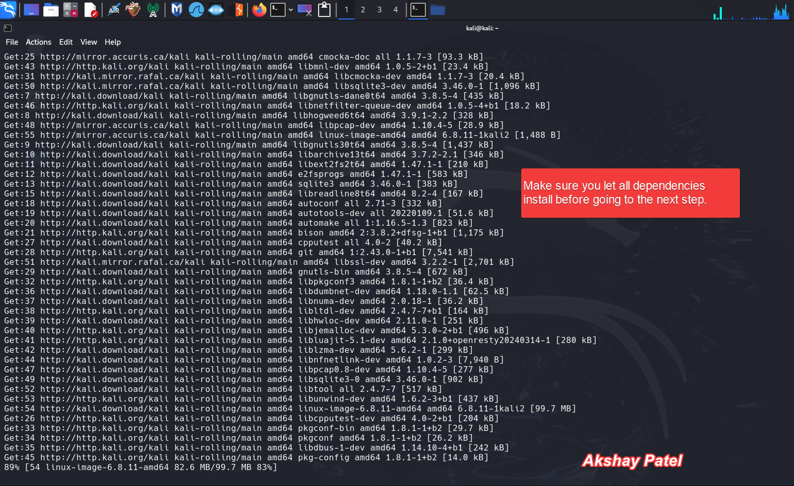

4. **Install Snort on Kali Linux**:
   ```bash
   sudo apt-get update
   sudo apt-get install snort
   ```
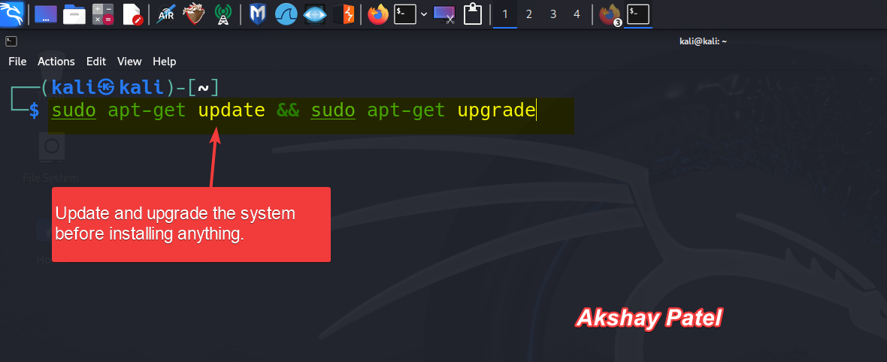  


## Network Configuration

1. **Configure Network for VMs**:
   - Set up both Metasploitable 2 and Kali Linux VMs in the same internal network in VirtualBox.
   - Ensure both VMs can communicate with each other.
   - You can check my [Home Lab for Cybersecurity Project](https://github.com/AkshayPatel03/home-lab-for-cybersecurity) repository to learn how to build home lab and network configuration for VMs required for this project. 


2. **Test Network Connectivity**:
   - From the Kali Linux VM, ping the Metasploitable 2 VM to verify connectivity.
   ```bash
   ping <Metasploitable_IP>
   ping 192.168.10.4
   ```

## Snort Configuration

1. **Edit Snort Configuration File**:
   - Open the Snort configuration file. You can use nano text editor too. 
   ```bash
   sudo mousepad /etc/snort/snort.lua
   ```
   - Set the `HOME_NET` variable to the IP range of your internal network.
   - For example, if your host machine is having `192.168.10.5` ip address with subnet of 24 then here we can add IP range as `192.168.10.0/24`

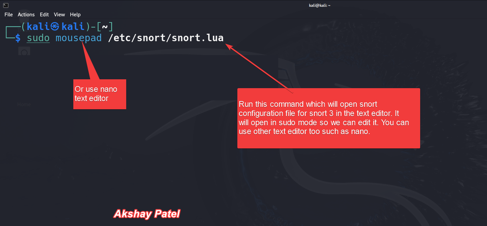


2. **Create Snort Rules**:
   - Create a directory for custom rules.
   - Or in my case, I would be able to go to this directory from the terminal. 
   ```bash
   sudo mkdir /etc/snort/rules
   ```
   - Create a rule to detect ping requests.
   ```bash
   sudo mousepad /etc/snort/rules/local.rules
   ```
   - Add the following rule:
   - We can use tool called [`Snorpy`](http://snorpy.cyb3rs3c.net/) to generate the rules.

   ```plaintext
   alert icmp any any -> any any (msg:"ICMP Ping Detected"; sid:1000001; rev:1;)
   ```

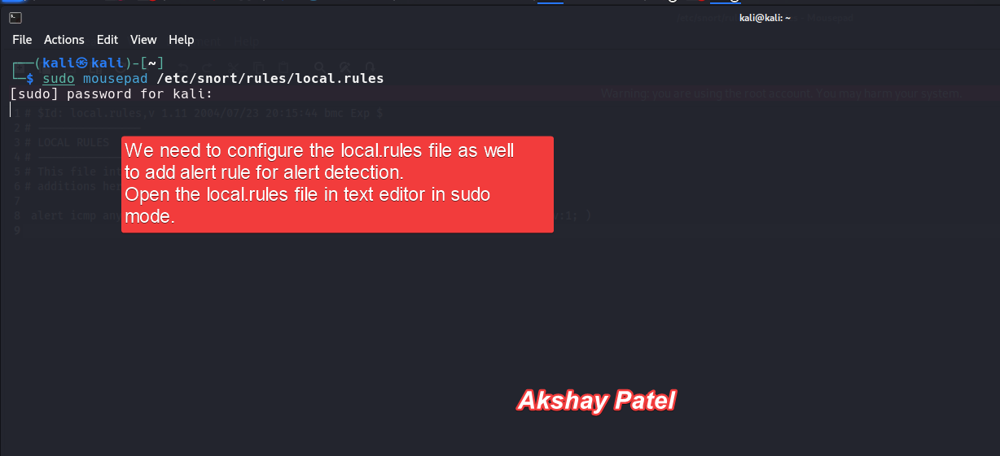

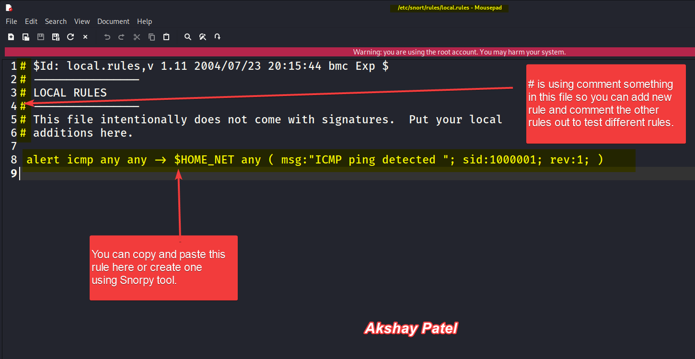

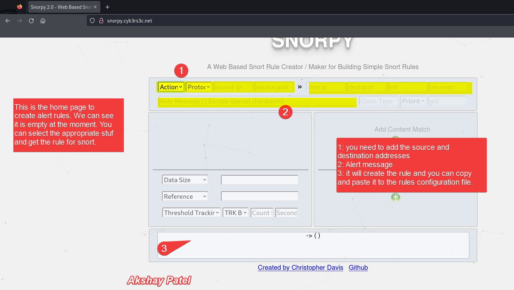


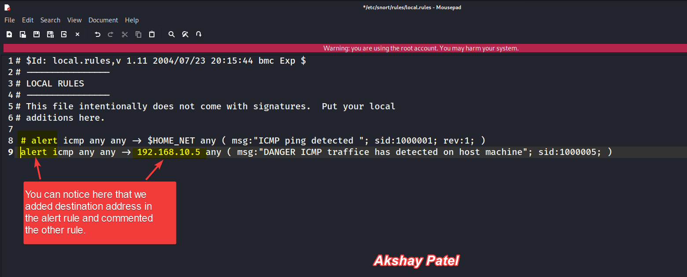


## Running Snort

1. **Start Snort in IDS Mode**:
   ```bash
   sudo snort -A console -q -c /etc/snort/snort.lua -i eth1
   ```

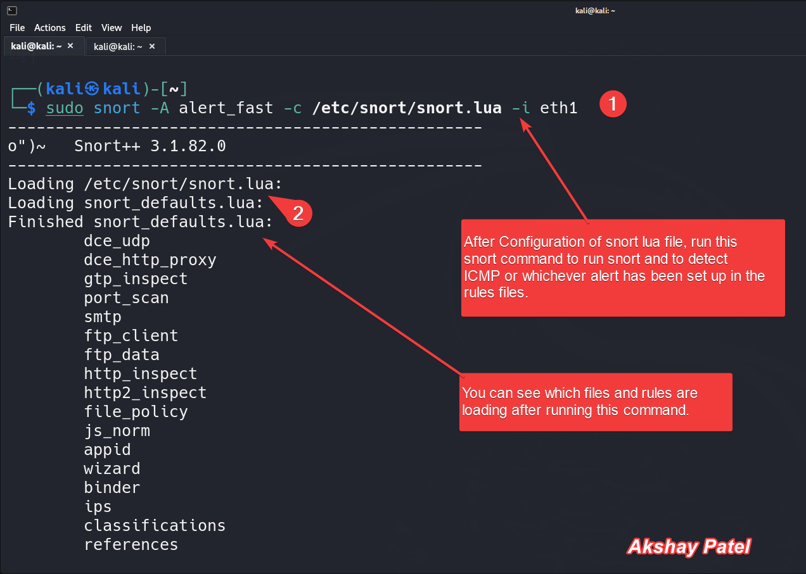

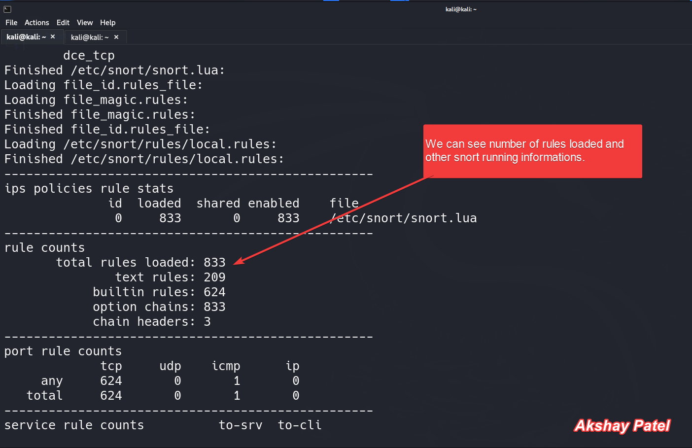


2. **Generate Alerts**:
   - From Metasploitable 2, send a ping to the Kali Linux VM.
   ```bash
   ping <Kali_Linux_IP>
   ping 192.168.10.5
   ```
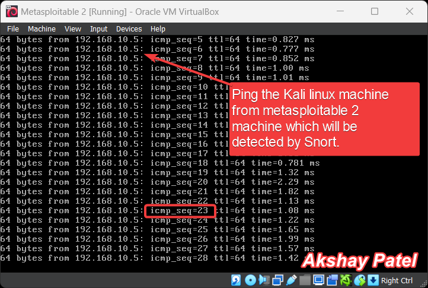


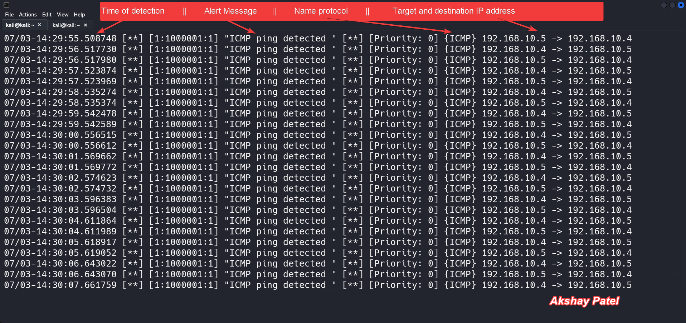

Check this [Snort Packets detection Statestic](reports\Snort_Packet_Statistics.txt) out. 

- Observe the alerts generated in the Snort console.

## Check this `reports` in text files
- [ICMP Packet Detection file#2](reports/Snort_ICMP_alerts.txt)

- [ICMP Packet Detection file#1](reports/Snort_Packet_Statistics_destination.txt)

- [ICMP Packet Detection file#3](reports/Snort_ICMP_Destination_alerts.txt)

## Implementing IPS

1. **Install and Configure iptables**:
   - Ensure `iptables` is installed on Kali Linux.
   ```bash
   sudo apt-get install iptables
   ```
   - Create an iptables rule to drop malicious traffic.
   ```bash
   sudo iptables -A INPUT -p icmp -j DROP
   ```

2. **Integrate Snort with iptables**:
   - Use a tool like `snort-inline` to integrate Snort with iptables (installation and configuration details will depend on the specific tool used).

## Conclusion

This project provides a comprehensive demonstration of setting up an Intrusion Detection System (IDS) and Intrusion Prevention System (IPS) using Snort. By following the outlined steps, various cyber attacks can be detected and prevented, enhancing practical cybersecurity skills. This hands-on experience involves implementing robust security measures and contributes to a deeper understanding of cybersecurity principles and practices.